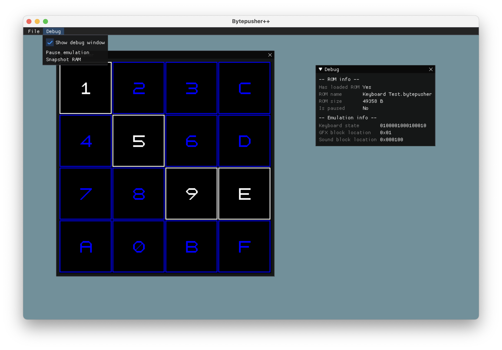

# Bytepusher++

This is an implementation of the [Bytepusher](https://esolangs.org/wiki/BytePusher) fantasy console in C++ and SDL2, complete with a humble debug interface written in ImGui inspired by [Lauchmelder](https://github.com/Lauchmelder23)'s [GameBoy emulator](https://github.com/Lauchmelder23/yabgbe).

I've only tested this on a Mac, but considering all dependencies are platform-agnostic there shouldn't be any issues running this on Windows or Linux.

I tried to document best to my abilities how each component works in its respective header file, so I won't write more about how the Bytepusher works here. The 16 controller keys are mapped to 1234QWERASDFZXCV -- you can test them out with the "Keyboard Test.bytepusher" ROM.

You can take snapshots of the RAM with the "Debug -> Snapshot RAM" button. They will be saved to the "snapshots" directory in the project and will be named according to the format `<date of VM bootup>: <number of snapshot>.bytepusher`.

## Building and running
You can build the project using either CMake or [Click](https://github.com/c1m5j/click), a one-command C/C++ build tool made by me. Once you're in the project directory just run `click`. The binary will be outputted to the "build" directory (unless you specify a different one in click.toml).

Run the binary without any console arguments — ROMs are loaded in the interface using a file dialog.

There are some ROMs in the "roms" directory which I got from the Esolangs page and [JonathanDC64's implementation](https://github.com/JonathanDC64/BytePusher) (because not all links on Esolangs worked); you can use them or choose your own. Those which are in "roms" have all been tested and each works correctly.

<!-- ## Acknowledgments -->
Built with
* [SDL2](https://www.libsdl.org/download-2.0.php), 
* [ImGui](https://github.com/ocornut/imgui),
* [imgui_sdl](https://github.com/Tyyppi77/imgui_sdl),
* and [ImGuiFileDialog](https://github.com/aiekick/ImGuiFileDialog) (had to tweak some code to make the Cancel button work).

I wasn't sure how to implement the audio (this is my first "real" project with SDL), so I looked into David Jolly (majestic53)'s [bpvm](https://github.com/majestic53/bpvm), an awesome and professional implementation of the Bytepusher. As a result of that some audio-related code may look similar, but I never explicitly copied any. A great thanks to David for bpvm!

Credit also goes to Lauchmelder for helping me with some SDL (and other) bugs I would've never found myself.